# Video Generation Pipeline Architecture

## System Overview

This diagram illustrates the complete video generation pipeline, from initial research through final video production.

```mermaid
flowchart TD
    A["<b>Perplexity Research</b><br/>Top 1000 Campaigns → Patterns<br/><br/><b>Top 5 Patterns:</b><br/>1. Problem-Solution<br/>2. Challenger-Underdog<br/>3. Lifestyle-Identity<br/>4. Entertainment-Spectacle<br/>5. Social-Cultural Movement"] --> B
    
    B["<b>Generate Concepts</b><br/>Multiple versions via prompt templates<br/>For diversity & pattern application<br/><br/><i>Example: Scene 1 - Hook</i><br/><i>Scene 2 - Problem/Conflict</i><br/><i>Scene 3 - Solution/Resolution</i>"] --> C
    
    C["<b>LLM Judge</b><br/>Evaluate & score concepts<br/>Select best concept"] --> D
    
    D["<b>Extract Best Concept</b><br/>Isolate winning concept"] --> E
    
    E["<b>Revise Script</b><br/>Refine & optimize<br/>video script structure"] --> F
    
    F["<b>Generate Universe</b><br/>Define characters, locations,<br/>props, visual style"] --> G
    
    G["<b>Generate Reference Images</b><br/>Create visual references<br/>for characters & locations"] --> H
    G -->|sora2| I
    G -->|veo3.1| J
    
    H["<b>Generate Scene Prompts</b><br/>Craft detailed prompts<br/>for each video scene"] --> I
    
    I["<b>Generate First Frames</b><br/>Create starting frames<br/>for video clips"] --> J
    
    J["<b>Generate Video Clips</b><br/>Produce individual<br/>scene videos"] --> K
    
    K["<b>Merge Clips</b><br/>Combine into final<br/>cohesive video"]
    
    click B href "s1_generate_concepts/inputs/prompt_templates/advanced_structured.md" "View Advanced Prompt Template"
    
    style A fill:#e1f5ff
    style B fill:#fff4e1
    style C fill:#ffe1e1
    style D fill:#f0ffe1
    style E fill:#f0ffe1
    style F fill:#f0ffe1
    style G fill:#e1e5ff
    style H fill:#e1e5ff
    style I fill:#e1e5ff
    style J fill:#ffe1f5
    style K fill:#ffe1f5
```



## Pipeline Phases

### Phase 1: Research & Ideation (Blue)
- Research top-performing campaigns
- Extract proven patterns

### Phase 2: Concept Generation (Yellow)
- Generate multiple ad concepts using templates
- Apply proven patterns for diversity

### Phase 3: Evaluation (Red)
- LLM-based judging system
- Score and rank concepts

### Phase 4: Script Development (Green)
- Extract winning concept
- Revise and optimize script structure

### Phase 5: Universe Building (Purple)
- Define visual universe
- Create characters, locations, props
- Generate reference images

### Phase 6: Video Production (Pink)
- Generate scene prompts
- Create first frames
- Generate video clips with Sora 2
- Merge into final video

## Customization

To modify the diagram colors, update the `style` lines:
```
style NodeID fill:#HEXCOLOR,stroke:#HEXCOLOR,stroke-width:2px,color:#HEXCOLOR
```

